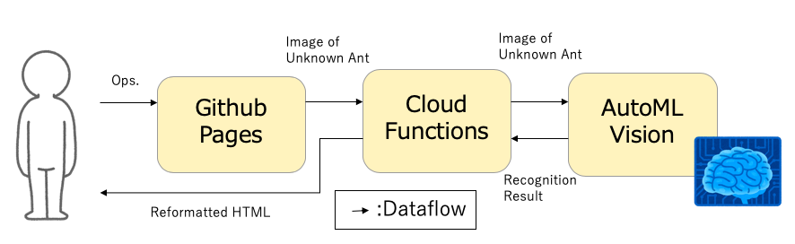

# Fire ant recognition service with Google Cloud Platform.
This is a repository to test the AutoML such as AutoML Vision, 
AutoKeras and AutoPyTourch on the theme of Fire ant recognition.

## Reconize fire ants with AutoML Vision and Cloud Functions
A sample architecture is as follow:

- Create a Image classifier by AutoML Vision.
    - You can learn how to make a classifier with official tutorial.
- Deploy the model on AutoML Vision.
- TBD

## Reconize fire ants with AutoKeras and Cloud Functions
A sample architecture is as follow:

- Create a Image classifier by AutoML Vision.
    - You can learn how to make a classifier with official tutorial.
- Deploy the model on AutoML Vision.
- TBD